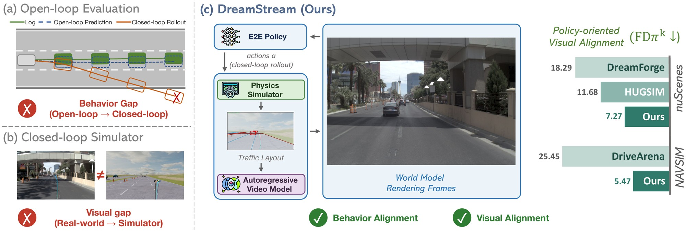
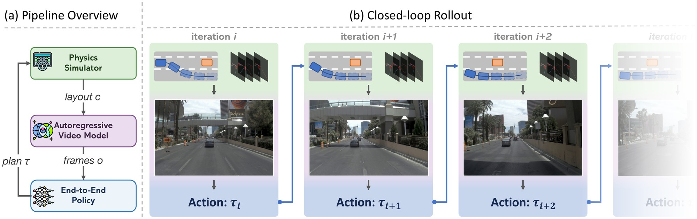
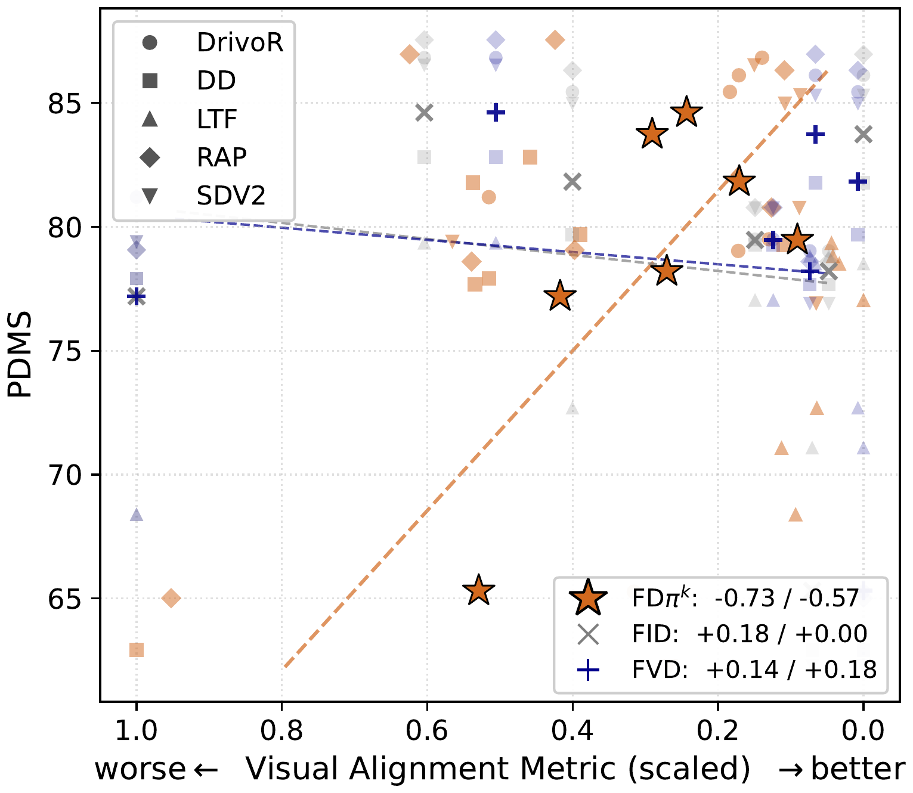
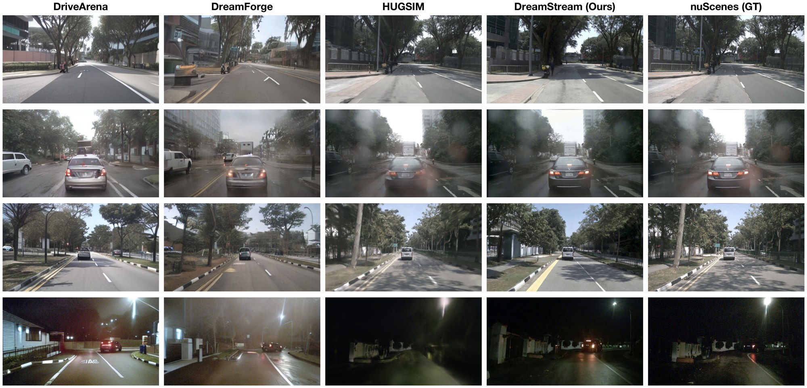
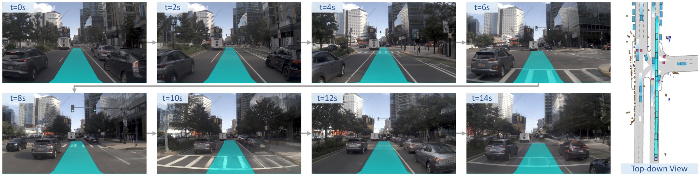
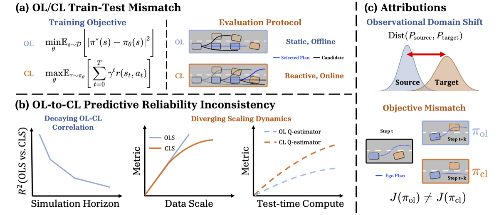
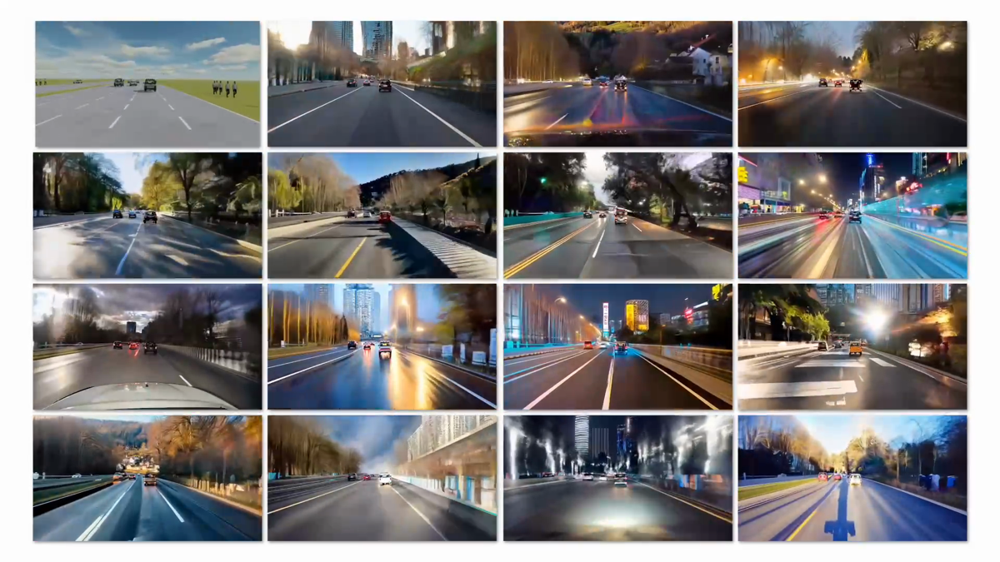

<style>
  /* Header: hide the layout's Code/Paper row so the equal-contribution note
     can sit directly below the institutions (same approach as the WorldWeaver page). */
  .post-header > .col-12 { margin-bottom: 0.4rem !important; }
  .post-header > .col-12[align="center"] { display: none; }

  .ds-equal-note {
    color: #444;
    font-size: 1rem;
    margin: 0 0 0.45rem;
    text-align: center;
  }
  html[data-theme='dark'] .ds-equal-note { color: #bcc4cf; }

  .ds-resource-links {
    font-size: 1.2rem;
    margin: 0.2rem 0 1rem;
    text-align: center;
  }
  .ds-resource-links a { font-weight: 700; }

  .ds-caption {
    text-align: center;
    font-style: italic;
    color: #555;
    margin-top: 8px;
    margin-bottom: 4px;
  }
  html[data-theme='dark'] .ds-caption { color: #aab2bd; }

  .ds-note {
    text-align: center;
    font-size: 0.85em;
    font-style: italic;
    color: #888;
    margin-top: 4px;
  }

  .ds-video-label {
    text-align: center;
    font-weight: 600;
    margin: 0 0 6px 0;
  }

  .ds-row {
    display: flex;
    gap: 20px;
    align-items: flex-start;
    margin: 0 auto;
  }
  .ds-row > div { flex: 1; min-width: 0; }
  .ds-row-center { align-items: center; }

  /* FDπk table: leftmost dataset column spanning its rows */
  .ds-fd-table th:first-child,
  .ds-fd-table td.ds-dataset {
    text-align: center;
    white-space: nowrap;
  }
  .ds-fd-table td.ds-dataset {
    font-weight: 600;
    font-style: italic;
    border-right: 1px solid var(--global-divider-color);
    background: rgba(128, 128, 128, 0.06);
  }
  .ds-fd-table td.ds-method { text-align: left; white-space: nowrap; }

  .ds-cards {
    display: grid;
    grid-template-columns: repeat(3, 1fr);
    gap: 14px;
    margin: 12px 0 4px;
  }
  .ds-card {
    border: 1px solid var(--global-divider-color);
    border-top: 3px solid var(--global-theme-color);
    border-radius: 6px;
    padding: 12px 14px;
    font-size: 0.95em;
  }
  .ds-card h4 {
    margin: 0 0 6px 0;
    font-size: 1.05em;
    font-weight: 700;
  }
  .ds-card p { margin: 0; }

  .ds-table {
    overflow-x: auto;
    margin: 8px auto 4px;
  }
  .ds-table table {
    width: 100%;
    border-collapse: collapse;
    font-size: 0.9em;
    line-height: 1.3;
  }
  .ds-table th, .ds-table td {
    padding: 5px 8px;
    text-align: center;
    vertical-align: middle;
    border-bottom: 1px solid var(--global-divider-color);
  }
  .ds-table thead th { border-bottom: 2px solid var(--global-divider-color); }
  .ds-table th:first-child, .ds-table td:first-child { text-align: left; white-space: nowrap; }
  .ds-table .ds-group {
    text-align: left;
    font-style: italic;
    background: rgba(128, 128, 128, 0.08);
  }
  .ds-table .ds-ours { background: rgba(39, 116, 174, 0.08); font-weight: 700; }
  .ds-table .ds-gap { color: #888; font-weight: 400; font-size: 0.9em; }

  @media (max-width: 768px) {
    .ds-row { flex-direction: column; }
    .ds-cards { grid-template-columns: 1fr; }
  }
</style>

<p class="ds-equal-note">
  <sup>*</sup>Equal contribution.
</p>

<p class="ds-resource-links">
  <a href="https://vail.cs.ucla.edu/DreamStream/"><b>Code (Coming Soon)</b></a> | <a href="https://vail.cs.ucla.edu/DreamStream"><b>Paper</b></a>
</p>

<div class="img-container" style="width: 100%; margin: 0 auto;">
    
</div>

<div class="research-section">
    <h3 style="text-align: center">TL;DR</h3>
    <ul style="list-style-type: none; padding-left: 0;">
      <strong>DreamStream</strong> is a generative closed-loop simulator for end-to-end driving.<br><br>
      1. 🎬 <strong>Generative closed-loop simulator.</strong> DreamStream couples a physics simulator with an autoregressive video model distilled from a pretrained video model, delivering diverse visual and behavioral realism.<br>
      2. 📏 <strong>FDπ<sup>k</sup>, a policy-oriented visual alignment metric.</strong> Measured by the Fréchet distance over the scene-context features that E2E policies use to generate decisions, it exhibits stronger correlation with the driving performance than FID and FVD. Under FDπ<sup>k</sup>, DreamStream improves by <strong>1.6×</strong> on nuScenes and <strong>4.7×</strong> on NAVSIM.<br>
      3. 🚦 <strong>Navhard-CL benchmark.</strong> Built on DreamStream, it turns the non-reactive NAVSIM <em>navhard</em> benchmark into <strong>reactive closed-loop</strong>, with safety-critical adversarial behaviors and diverse weather variations. It exposes failure modes prior closed-loop benchmarks overlook: <em>scorer bias</em>, <em>proposal-coverage failure</em>, and <em>visual brittleness</em>.
  </ul>
</div>

<!--research-section-splitter-->

## DreamStream Overview

<div class="img-container" style="width: 100%; margin: 0 auto;">
    
</div>
<br>
DreamStream consists of closed-loop interaction between three components: a <strong>physics simulator</strong> that maintains the symbolic states (agents poses, HD map), an <strong>autoregressive video model</strong> that renders the camera frames, and the <strong>E2E driving policy</strong> under evaluation. Each closed-loop iteration proceeds in three steps:<br>
(1) <strong>Plan</strong>: the policy produces a planned trajectory from the most recent camera frames.<br>
(2) <strong>Simulate</strong>: the simulator executes the plan and provides traffic-layout condition (perspective projection of the HD map and agents 3D boxes) for each new state.<br>
(3) <strong>Generate</strong>: conditioned on the layouts and a scene text prompt, the video model autoregressively generates the next camera frames, using a KV cache of earlier frames to keep the scenario consistent over hundreds of frames.<br>
<br>
Scenarios start from real-world driving logs, and surrounding agents can be controlled by IDM or adversarial policies. After the scenario terminates, the executed trajectory is scored with closed-loop metrics.

<!-- <p class="ds-video-label" style="margin-top: 18px;">Simulator Workflow</p> -->
<video muted autoplay playsinline controls loop style="width: 100%; height: auto; display: block;">
    <source src="../assets/projects/dreamstream/videos/pipeline.mp4" type="video/mp4">
    Your browser does not support the video tag.
</video>
<p class="ds-caption">
  DreamStream Simulator Workflow.
</p>

<!--research-section-splitter-->

## FDπ<sup>k</sup>: Policy-Oriented Visual Alignment

Perceptual metrics such as FID and FVD were designed for visual quality. Controllability metrics (3D detection, map segmentation) measure only one task-specific aspects of what human sees. <strong>FDπ<sup>k</sup></strong> instead measures from the policies' perspective: for a driving policy, we extract the scene-context features it uses to generate actions from real camera frames and generated frames of the same scenes, and compute the Fréchet distance between the resulting feature distributions. This captures how much the simulator perturbs the visual information the policy uses to act. It is normalized per-policy and averaged across a panel of public E2E policies.

<div class="ds-row ds-row-center" style="margin-top: 14px;">
  <div>
    <div class="ds-table ds-fd-table">
      <table>
        <thead>
          <tr>
            <th>Dataset</th>
            <th>Method</th>
            <th>FDπ<sup>k</sup> ↓</th>
            <th>FID ↓</th>
          </tr>
        </thead>
        <tbody>
          <tr><td class="ds-dataset" rowspan="7">nuScenes<br><em>val</em></td><td class="ds-method">MagicDrive</td><td>17.18</td><td>16.20</td></tr>
          <tr><td class="ds-method">Panacea</td><td>31.46</td><td>16.96</td></tr>
          <tr><td class="ds-method">Dreamland</td><td>25.28</td><td>47.93</td></tr>
          <tr><td class="ds-method">DriveArena<sup>*</sup></td><td>15.68</td><td>34.74</td></tr>
          <tr><td class="ds-method">DreamForge<sup>*</sup></td><td>18.29</td><td><strong>14.61</strong></td></tr>
          <tr><td class="ds-method">HUGSIM<sup>*</sup></td><td>11.68</td><td>27.95</td></tr>
          <tr class="ds-ours"><td class="ds-method">DreamStream</td><td>7.27</td><td>19.58</td></tr>
          <tr><td class="ds-dataset" rowspan="3">NAVSIM<br><em>navtest</em></td><td class="ds-method">BridgeSim</td><td>56.13</td><td>175.53</td></tr>
          <tr><td class="ds-method">DriveArena</td><td>25.45</td><td>41.80</td></tr>
          <tr class="ds-ours"><td class="ds-method">DreamStream</td><td>5.47</td><td>11.78</td></tr>
        </tbody>
      </table>
    </div>
    <p class="ds-note">
      FDπ<sup>k</sup> between real and generated/rendered frames from simulators. <sup>*</sup> trained on the evaluation set. FID misranks visual alignment.
    </p>
  </div>
  <div style="flex: 0 0 40%;">
    <div class="img-container" style="width: 100%; margin: 0 auto;">
        
    </div>
    <p class="ds-caption" style="font-size: 0.9em;">
      FDπ<sup>k</sup> correlates strongly with driving performance (PDMS), whereas FID and FVD do not.
    </p>
  </div>
</div>

<div class="img-container" style="width: 100%; margin: 18px auto 0;">
    
</div>
<p class="ds-caption">
  Qualitative comparison on nuScenes <em>val</em>. DreamStream preserves lane geometry, agent placement, and diverse appearance of the scenes.
</p>

<!--research-section-splitter-->

## Navhard-CL: A Closed-loop Benchmark

Navhard-CL turns the non-reactive, open-loop NAVSIM <em>navhard</em> benchmark into reactive closed-loop testing environments, with three scenario buckets:<br>
(1) <strong>Navhard-Base</strong>: the 421 real-world <em>navhard</em> scenarios with reactive traffic.<br>
(2) <strong>Navhard-AdvBehavior</strong>: safety-critical variants in which an adversarial agent maneuvers to provoke a collision, spanning five NHTSA pre-crash categories.<br>
(3) <strong>Navhard-AdvWeather</strong>: the same scenarios re-rendered under 13 appearance conditions across lighting, weather, and road surface, yielding more than 5k scenario-appearance combinations.

<div class="img-container" style="width: 100%; margin: 16px auto 0;">
    
</div>
<p class="ds-caption">
  A closed-loop rollout on Navhard-Base.
</p>

<!-- ### Closed-loop Rollouts -->

<p class="ds-video-label">Navhard-Base</p>
<video muted autoplay playsinline controls loop style="width: 100%; height: auto; display: block; margin-bottom: 4px;">
    <source src="../assets/projects/dreamstream/videos/navhard_base.mp4" type="video/mp4">
    Your browser does not support the video tag.
</video>

<p class="ds-video-label">Navhard-AdvBehavior</p>
<video muted autoplay playsinline controls loop style="width: 100%; height: auto; display: block; margin-bottom: 4px;">
    <source src="../assets/projects/dreamstream/videos/navhard_advbehavior.mp4" type="video/mp4">
    Your browser does not support the video tag.
</video>

<p class="ds-video-label">Navhard-AdvWeather</p>
<video muted autoplay playsinline controls loop style="width: 100%; height: auto; display: block; margin-bottom: 4px;">
    <source src="../assets/projects/dreamstream/videos/navhard_advweather.mp4" type="video/mp4">
    Your browser does not support the video tag.
</video>

### Closed-loop Evaluation

<div class="ds-table" style="max-width: 640px;">
  <table>
    <thead>
      <tr>
        <th>Policy</th>
        <th>Simulator RGB</th>
        <th>DriveArena</th>
        <th>DreamStream</th>
      </tr>
    </thead>
    <tbody>
      <tr><td>DrivoR</td><td>42.32</td><td>38.92</td><td><strong>46.21</strong></td></tr>
      <tr><td>DiffusionDrive</td><td>46.19</td><td>32.02</td><td><strong>59.68</strong></td></tr>
      <tr><td>DiffusionDriveV2</td><td>45.87</td><td>21.48</td><td><strong>58.35</strong></td></tr>
      <tr><td>LTF</td><td>40.64</td><td>38.27</td><td><strong>53.28</strong></td></tr>
    </tbody>
  </table>
</div>
<p class="ds-note">
  Closed-loop driving score (DS) on Navhard-Base under three observation sources for the same simulator state.
</p>

### Closed-loop Gap Analysis

<div class="ds-cards">
  <div class="ds-card">
    <h4>Scorer bias</h4>
    <p>Learned scorers of E2E policies pick worse proposals due to scorer bias, and the gap widens under adversarial behaviors.</p>
  </div>
  <div class="ds-card">
    <h4>Proposal-coverage failure</h4>
    <p>The proposal set of E2E policies often contains no feasible recovery trajectory when deviating from the policy’s training distribution.</p>
  </div>
  <div class="ds-card">
    <h4>Visual brittleness</h4>
    <p>Lighting shifts and common weather barely change policy performance, but conditions that obscure the road surface degrade performance.</p>
  </div>
</div>

<!--research-section-splitter-->

## Reference

```
@inproceedings{leng2026dreamstream,
  title={DreamStream: Towards Policy-Oriented Generative Simulation for End-to-End Driving},
  author={Leng, Ziyang and Mo, Sicheng and Zhao, Seth Z. and Cai, Haoyuan and Zeng, Yu and McAllister, Rowan and Zhou, Bolei},
  booktitle={Conference on Robot Learning (CoRL)},
  year={2026}
}
```

## Acknowledgement

This work is supported by the Toyota Research Institute. Seth Z. Zhao was supported by the Qualcomm Innovation Fellowship.

## Relevant Work

<div class="citation">
    <div class="image"></div>
    <div class="comment">
      <a href="https://vail-ucla.github.io/BridgeSim/" target="_blank">
        BridgeSim: Unveiling the OL-CL Gap in End-to-End Autonomous Driving.
        CoRL 2026.</a><br>
    </div>
</div>

<div class="citation">
    <div class="image"></div>
    <div class="comment">
      <a href="https://metadriverse.github.io/dreamland/" target="_blank">
        Dreamland: Controllable World Creation with Simulator and Generative Models.
        arXiv 2025.</a><br>
    </div>
</div>

<script>
// This page has several large videos. Browsers cap how many can decode at once,
// so play each video only while it is on screen and pause it when it scrolls away.
(function () {
  function init() {
    var vids = [].slice.call(document.querySelectorAll('video'));
    vids.forEach(function (v) {
      v.removeAttribute('autoplay');
      v.muted = true;
      v.setAttribute('playsinline', '');
      try { v.preload = 'metadata'; } catch (e) {}
    });
    if (!('IntersectionObserver' in window)) {
      vids.forEach(function (v) { var p = v.play(); if (p && p.catch) p.catch(function () {}); });
      return;
    }
    var io = new IntersectionObserver(function (entries) {
      entries.forEach(function (e) {
        var v = e.target;
        if (e.isIntersecting) { var p = v.play(); if (p && p.catch) p.catch(function () {}); }
        else { v.pause(); }
      });
    }, { threshold: 0.2 });
    vids.forEach(function (v) { io.observe(v); });
  }
  if (document.readyState === 'loading') document.addEventListener('DOMContentLoaded', init);
  else init();
})();
</script>
